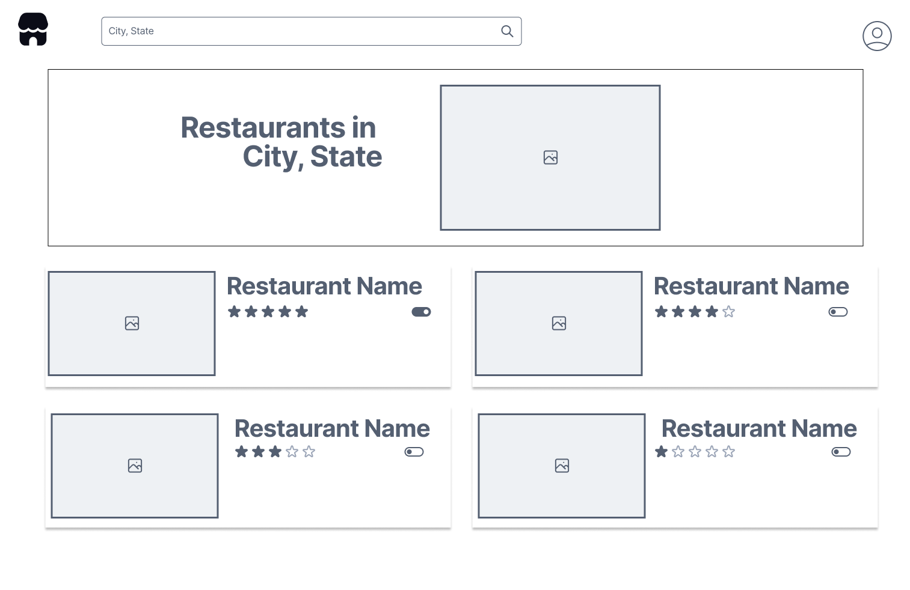
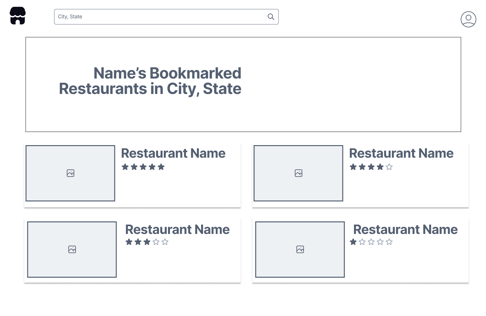
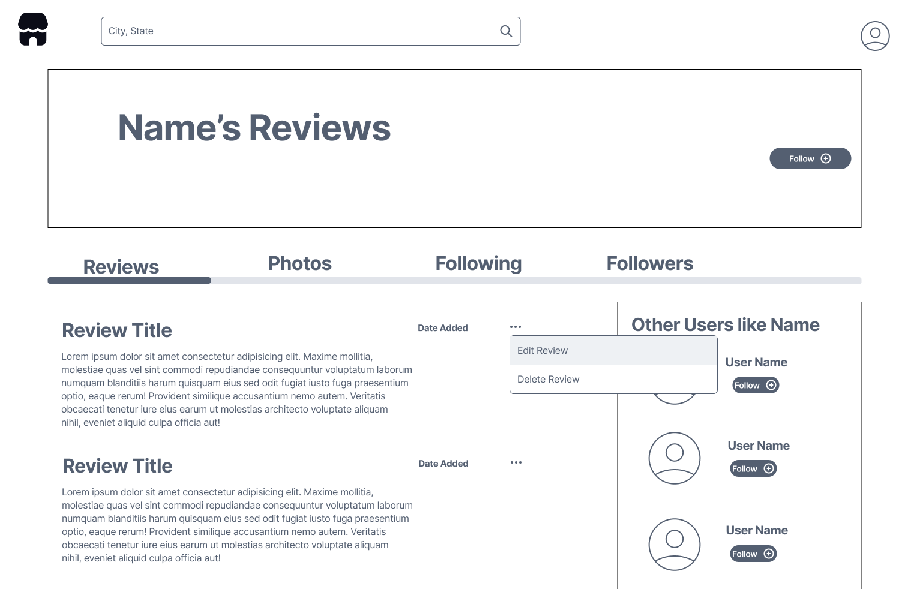
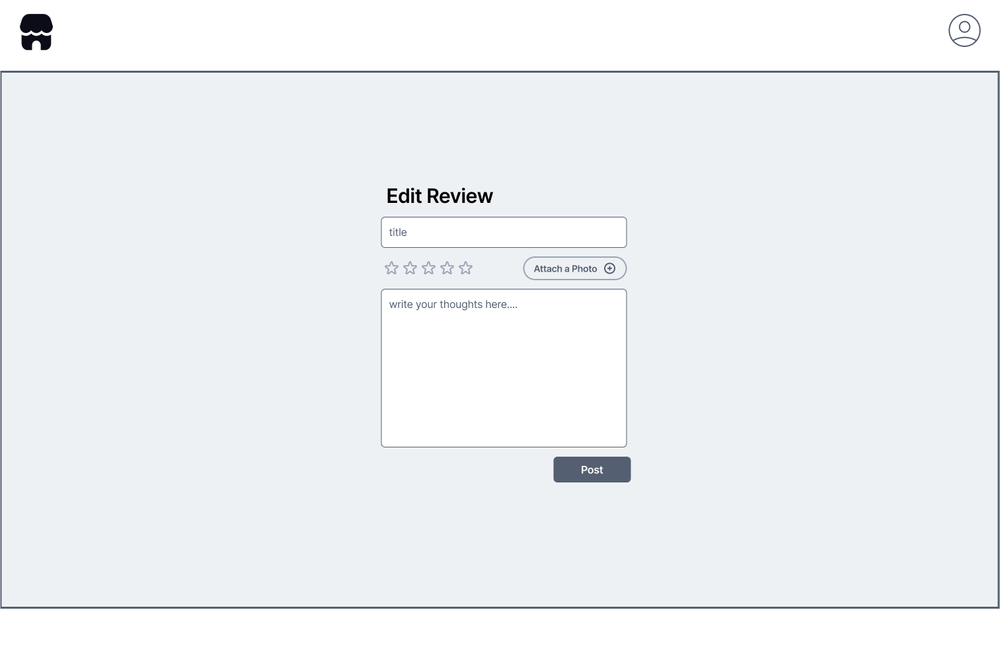
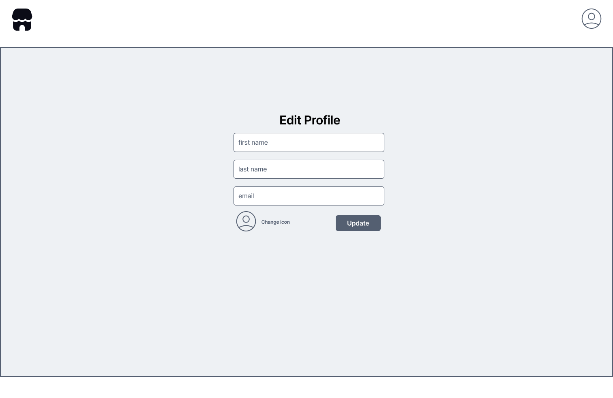

# Customer Graphical Human Interface

## Home Page

This will be the first page visitors arrive to on the website.

## Home Page Cont.

This illustrates what a user will see after clicking the icon in the upper right corner.

## Sign Up Page

This is the sign up form that users will fill out to create an account for the website.

## Login Page

This is the login form that users will fill out to log into their account for the website.

## List Restaurants Page

This is the list restaurants page that users will see after searching for a specific location.

## Restaurant Details Page Cont.

There is a toggle button on the list restaurants page that allows a user to favorite/bookmark a restaurant.

## Favorited/Bookmarked Restaurants Page

This page lists all of a particular user's favorited/bookmarked restaurants.

## Restaurant Details Page

This is the restaurant details page that displays the most recent reviews from Google and a Reviews tab with user reviews.

## Restaurant Details Page Cont.

The restaurant details page has an additional tab that displays photos from the Google reviews.

## Restaurant Details Page Cont.

Lastly, there is an About tab on the restaurant details page that provides further information about the Restaurant such as operating hours and contact information.

## Review Page

When a user clicks the add a review button on the restaurant details page, they will be directed to this review form.

## User Review Page

This is the user review page. This page has a Reviews tab with a list of all of the user reviews.

## User Review Page Cont.

This page shows the Photos tab which has a list of all of the user photos that have been uploaded.

## User Review Page Cont.

This page shows the Following tab which has a list of all of the users that a particular user is following on the website.

## User Review Page Cont.

This page shows the Followers tab which has a list of all of the users that follow a particular user on the website.

## User Review Page Cont.

On the user's review page there is an ellipsis that when clicked provides the user with an option to edit or delete the review.

## Edit Review Page

This is the page the user is routed to after clicking the edit review button shown on the previous page.

## Edit Profile Page

The user has the ability to edit their profile information and change their icon from the edit profile page.

